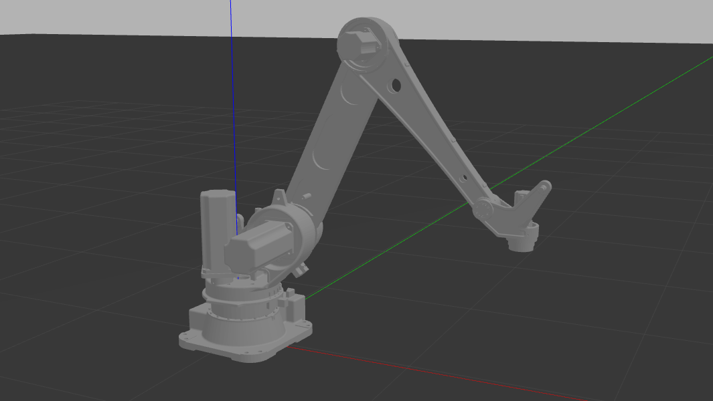

<!-- Improved compatibility of back to top link: See: https://github.com/othneildrew/Best-README-Template/pull/73 -->
<a name="readme-top"></a>
<!--
*** Thanks for checking out the Best-README-Template. If you have a suggestion
*** that would make this better, please fork the repo and create a pull request
*** or simply open an issue with the tag "enhancement".
*** Don't forget to give the project a star!
*** Thanks again! Now go create something AMAZING! :D
-->


<!-- PROJECT SHIELDS -->
<!--
*** I'm using markdown "reference style" links for readability.
*** Reference links are enclosed in brackets [ ] instead of parentheses ( ).
*** See the bottom of this document for the declaration of the reference variables
*** for contributors-url, forks-url, etc. This is an optional, concise syntax you may use.
*** https://www.markdownguide.org/basic-syntax/#reference-style-links
-->
[![Contributors][contributors-shield]][contributors-url]
[![Forks][forks-shield]][forks-url]
[![Stargazers][stars-shield]][stars-url]
[![Issues][issues-shield]][issues-url]
[![MIT License][license-shield]][license-url]
[![LinkedIn][linkedin-shield]][linkedin-url]


<!-- PROJECT LOGO -->
<br />
<div align="center">
  <!-- <a href="https://github.com/andrefdre/Robot_szgh">
    
  </a> -->

  <h3 align="center">Best-README-Template</h3>

  <p align="center">
    Simulator of the szgh-b2300-e-4 robot
    <br />
    <a href="https://github.com/andrefdre/Robot_szgh"><strong>Explore the docs »</strong></a>
    <br />
    <br />
    <a href="https://github.com/andrefdre/Robot_szgh">View Demo</a>
    ·
    <a href="https://github.com/andrefdre/Robot_szgh/issues">Report Bug</a>
    ·
    <a href="https://github.com/andrefdre/Robot_szgh/issues">Request Feature</a>
  </p>
</div>


<!-- TABLE OF CONTENTS -->
<details>
  <summary>Table of Contents</summary>
  <ol>
    <li>
      <a href="#about-the-project">About The Project</a>
      <ul>
        <li><a href="#built-with">Built With</a></li>
      </ul>
    </li>
    <li>
      <a href="#getting-started">Getting Started</a>
      <ul>
        <li><a href="#installation">Installation</a></li>
      </ul>
    </li>
    <li><a href="#usage">Usage</a></li>
    <li><a href="#license">License</a></li>
    <li><a href="#contact">Contact</a></li>
  </ol>
</details>


<!-- ABOUT THE PROJECT -->
## About The Project

[![Product Name Screen Shot][product-screenshot]](https://github.com/andrefdre/Robot_szgh)

This project started from the need to quickly program a robot and test it in the environment without the need to program it by trial and error.

This project allows to quickly get the direct kinematics of the robot as well as the inverse kinematics, allowing to quickly program a robot and visualize it's performance. The robot was implemented in RViz as well as Gazebo. The last one allows to simulate the interaction of the robot with the environment, meaning that we can test the movements of the robot and the environment around.

<p align="right">(<a href="#readme-top">back to top</a>)</p>


### Built With

This code was developed with the help of ROS.

* [![ROS][ROS.js]][ROS-url]

<p align="right">(<a href="#readme-top">back to top</a>)</p>

## Getting Started

### Installation

First step is to clone the repository and install it's dependencies.


1. Clone the repo
   ```sh
   git clone https://github.com/andrefdre/Robot_szgh.git
   ```

<p align="right">(<a href="#readme-top">back to top</a>)</p>


<!-- USAGE EXAMPLES -->
## Usage

To use the code there is two options. As mentioned before the robot can be launched using RViz, which doesn't have a simulation environment, or Gazebo.

To run the code in gazebo run:
```
roslaunch robot_bringup robot_bringup.launch
```

To run the code in RViz run:
```
roslaunch robot_bringup robot_bringup_rviz.launch
```

<p align="right">(<a href="#readme-top">back to top</a>)</p>


<!-- LICENSE -->
## License

Distributed under the MIT License. See `LICENSE.txt` for more information.

<p align="right">(<a href="#readme-top">back to top</a>)</p>


<!-- CONTACT -->
## Contact

André Cardoso - [@your_twitter](https://twitter.com/your_username) - email@example.com

Project Link: [https://github.com/andrefdre/Robot_szgh](https://github.com/andrefdre/Robot_szgh)

<p align="right">(<a href="#readme-top">back to top</a>)</p>


<!-- MARKDOWN LINKS & IMAGES -->
<!-- https://www.markdownguide.org/basic-syntax/#reference-style-links -->
[contributors-shield]: https://img.shields.io/github/contributors/andrefdre/Robot_szgh.svg?style=for-the-badge
[contributors-url]: https://github.com/andrefdre/Robot_szgh/graphs/contributors
[forks-shield]: https://img.shields.io/github/forks/othneildrew/Best-README-Template.svg?style=for-the-badge
[forks-url]: https://github.com/andrefdre/Robot_szgh/network/members
[stars-shield]: https://img.shields.io/github/stars/othneildrew/Best-README-Template.svg?style=for-the-badge
[stars-url]: https://github.com/andrefdre/Robot_szgh/stargazers
[issues-shield]: https://img.shields.io/github/issues/othneildrew/Best-README-Template.svg?style=for-the-badge
[issues-url]: https://github.com/andrefdre/Robot_szgh/issues
[license-shield]: https://img.shields.io/github/license/othneildrew/Best-README-Template.svg?style=for-the-badge
[license-url]: https://github.com/andrefdre/Robot_szgh/blob/master/LICENSE.txt
[linkedin-shield]: https://img.shields.io/badge/-LinkedIn-black.svg?style=for-the-badge&logo=linkedin&colorB=555
[linkedin-url]: https://www.linkedin.com/in/andr%C3%A9-cardoso-8bb264223/
[product-screenshot]: images/robot.png

[ROS.js]: https://img.shields.io/ros/v/noetic/ros
[ROS-url]: https://www.ros.org/
